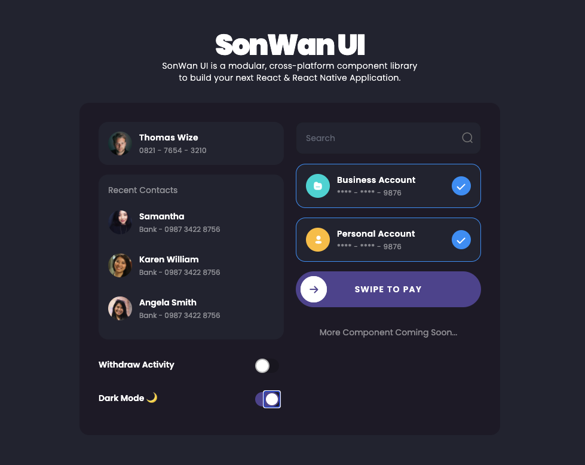

<h1 align="center">
  SonWan UI
</h1>



## 🚀 Quick start

1.  **Start developing.**

    Navigate into your new site’s directory and start it up.

    ```shell
    yarn start
    ```

## Getting started with SonWan UI

Inside your React project directory install SonWan UI by running the following

```sh

npm i sonwan-ui

# or

yarn add sonwan-ui

```

Then import the css styling and js components by including this code in your js/tsx file

```javascript
import "sonwan-ui/build/style.min.css";
import SonWan from "sonwan-ui";
```

To use it, just simply render the component in your render function

```javascript
const { Input, Switch, Card, CardItem, ListItem } = SonWan;
return (
  <>
    <Input placeholder="Search In Codesandbox" />
    <Card>
      <CardItem
        title="Yuzuha Usagi"
        subtitle="0821 - 7654 - 3210"
      />
    </Card>
  </>
);
```

## Demo

Demo: [CodeSandbox](https://codesandbox.io/s/sonwan-ui-hl4yh?from-embed)

Demo Chat UI: [SonWan Chat UI](https://sonwan-chat.vercel.app)
Code: [SonWan Chat Github](https://github.com/sonnylazuardi/sonwan-chat)


## React Native Support

Please check out https://github.com/Drzaln/SonWanUI-RN